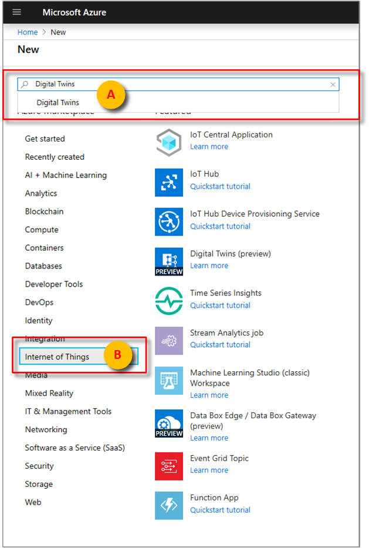
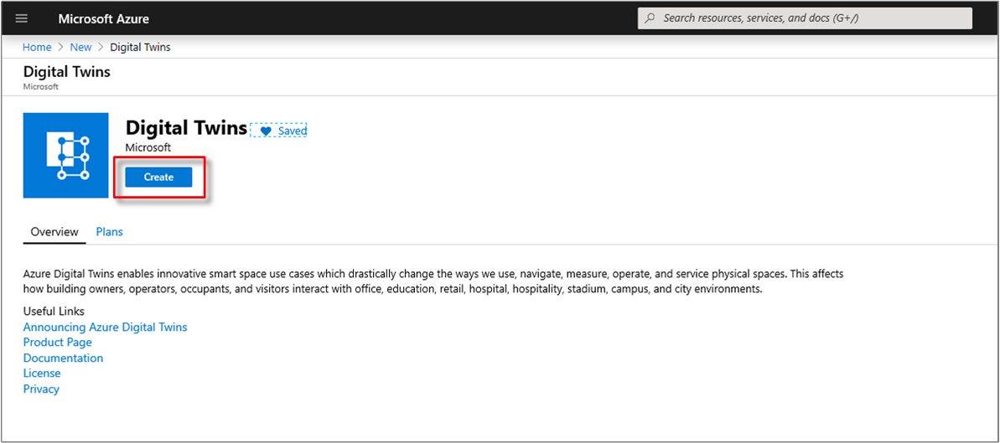

1. Sign in to the [Azure portal](https://portal.azure.com).

1. Select the home side-bar, then **+ Create a resource**. 

   [](./media/create-digital-twins-portal/create-a-resource.png#lightbox)

1. Search for **Digital Twins**, and select **Digital Twins**. 

   [](./media/create-digital-twins-portal/create-digital-twins.png#lightbox)

   Alternatively, select **Internet of Things**, and select **Digital Twins (preview)**.

1. Select **Create** to start the deployment process.

   [](./media/create-digital-twins-portal/create-and-confirm-resource.png#lightbox)

1. In the **Digital Twins** pane, enter the following information:
   * **Resource Name**: Create a unique name for your Digital Twins instance.
   * **Subscription**: Choose the subscription that you want to use to create this Digital Twins instance. 
   * **Resource group**: Select or create a [resource group](https://docs.microsoft.com/azure/azure-resource-manager/resource-group-overview#resource-groups) for the Digital Twins instance.
   * **Location**: Select the closest location to your devices.

     [](./media/create-digital-twins-portal/create-digital-twins-param.png#lightbox)

1. Review your Digital Twins information, and then select **Create**. Your Digital Twins instance might take a few minutes to be created. You can monitor the progress in the **Notifications** pane.

1. Open the **Overview** pane of your Digital Twins instance. Note the link under **Management API**. The **Management API** URL is formatted as: 
   
   ```URL
   https://yourDigitalTwinsName.yourLocation.azuresmartspaces.net/management/swagger
   ```
   
   This URL takes you to the Azure Digital Twins REST API documentation that applies to your instance. Read [How to use Azure Digital Twins Swagger](../articles/digital-twins/how-to-use-swagger.md) to learn how to read and use this API documentation. Copy and modify the **Management API** URL to this format: 
    
   ```URL
   https://yourDigitalTwinsName.yourLocation.azuresmartspaces.net/management/api/v1.0/
   ```
    
   Your application will use the modified URL as the base URL to access your instance. Copy this modified URL to a temporary file. You'll need this in the next section.

   [](./media/create-digital-twins-portal/digital-twins-management-api.png#lightbox)