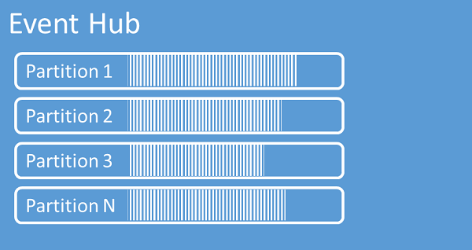

Event Hubs provides message streaming through a partitioned consumer pattern in which each consumer only reads a specific subset, or partition, of the message stream. This pattern enables horizontal scale for event processing and provides other stream-focused features that are unavailable in queues and topics.

A partition is an ordered sequence of events that is held in an event hub. As newer events arrive, they are added to the end of this sequence. A partition can be thought of as a "commit log."

Event Hubs retains data for a configured retention time that applies across all partitions in the event hub. Events expire on a time basis; you cannot explicitly delete them. Because partitions are independent and contain their own sequence of data, they often grow at different rates.

The number of partitions is specified at creation and must be between 1 and 32. The partition count is not changeable, so you should consider long-term scale when setting partition count. Partitions are a data organization mechanism that relates to the downstream parallelism required in consuming applications. The number of partitions in an event hub directly relates to the number of concurrent readers you expect to have. You can increase the number of partitions beyond 32 by contacting the Event Hubs team.

You may want to set it to be the highest possible value, which is 32, at the time of creation. Remember that having more than one partition will result in events sent to multiple partitions without retaining the order, unless you configure senders to only send to a single partition out of the 32 leaving the remaining 31 partitions redundant. In the former case, you will have to read events across all 32 partitions. In the latter case, there is no obvious additional cost apart from the extra configuration you have to make on Event Processor Host.

While partitions are identifiable and can be sent to directly, sending directly to a partition is not recommended. Instead, you can use higher level constructs introduced in the [Event publishers](../articles/event-hubs/event-hubs-features.md#event-publishers) section. 

Partitions are filled with a sequence of event data that contains the body of the event, a user-defined property bag, and metadata such as its offset in the partition and its number in the stream sequence.

We recommend that you balance 1:1 throughput units and partitions to achieve optimal scale. A single partition has a guaranteed ingress and egress of up to one throughput unit. While you may be able to achieve higher throughput on a partition, performance is not guaranteed. This is why we strongly recommend that the number of partitions in an event hub be greater than or equal to the number of throughput units.

Given the total throughput you plan on needing, you know the number of throughput units you require and the minimum number of partitions, but how many partitions should you have? Choose number of partitions based on the downstream parallelism you want to achieve as well as your future throughput needs. There is no charge for the number of partitions you have within an Event Hub.

For more information about partitions and the trade-off between availability and reliability, see the [Event Hubs programming guide](../articles/event-hubs/event-hubs-programming-guide.md#partition-key) and the [Availability and consistency in Event Hubs](../articles/event-hubs/event-hubs-availability-and-consistency.md) article.
