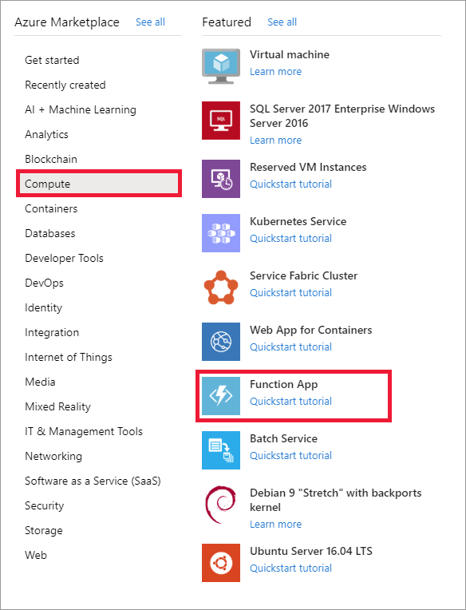
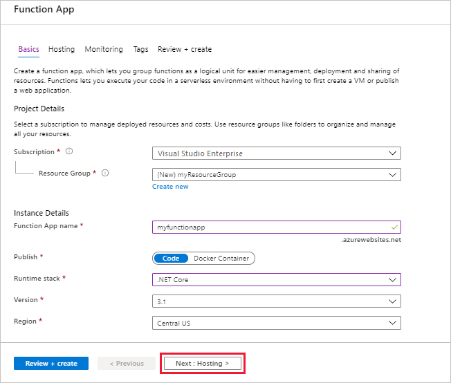
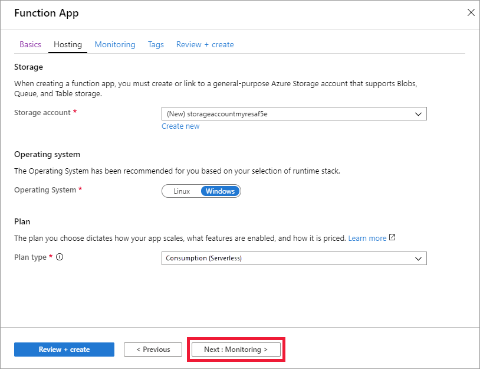

1. Open the Azure portal from [https://portal.azure.com](https://portal.azure.com)

1. Select the **Create a resource** button

    

1. Select **Compute** > **Function App**.

    

1. Use the function app settings as specified in the table below the image.

    

    | Setting      | Suggested value  | Description |
    | ------------ | ---------------- | ----------- |
    | **Subscription** | Your subscription | The subscription under which this new function app is created. |
    | **[Resource Group](../articles/azure-resource-manager/resource-group-overview.md)** |  *myResourceGroup* | Name for the new resource group in which to create your function app. |
    | **Function App name** | Globally unique name | Name that identifies your new function app. Valid characters are `a-z` (case insensitive), `0-9`, and `-`.  |
    |**Publish**| Code | Option to publish code files or a Docker container. |
    | **Runtime stack** | Preferred language | Choose a runtime that supports your favorite function programming language. Choose **.NET** for C# and F# functions. |
    |**Region**| Preferred region | Choose a [region](https://azure.microsoft.com/regions/) near you or near other services your functions access. |

    Select the **Next : Hosting >** button.

1. Enter the following settings for hosting.

    

    | Setting      | Suggested value  | Description |
    | ------------ | ---------------- | ----------- |
    | **[Storage account](../articles/storage/common/storage-quickstart-create-account.md)** |  Globally unique name |  Create a storage account used by your function app. Storage account names must be between 3 and 24 characters in length and may contain numbers and lowercase letters only. You can also use an existing account, which must meet the [storage account requirements](../articles/azure-functions/functions-scale.md#storage-account-requirements). |
    |**Operating system**| Preferred operating system | An operating system is pre-selected for you based on your runtime stack selection, but you can change the setting if necessary. |
    | **[Plan](../articles/azure-functions/functions-scale.md)** | Consumption plan | Hosting plan that defines how resources are allocated to your function app. In the default **Consumption Plan**, resources are added dynamically as required by your functions. In this [serverless](https://azure.microsoft.com/overview/serverless-computing/) hosting, you only pay for the time your functions run. When you run in an App Service plan, you must manage the [scaling of your function app](../articles/azure-functions/functions-scale.md).  |

    Select the **Next : Monitoring >** button.

1. Enter the following settings for monitoring.

    

    | Setting      | Suggested value  | Description |
    | ------------ | ---------------- | ----------- |
    | **[Application Insights](../articles/azure-functions/functions-monitoring.md)** | Default | Creates an Application Insights resource of the same *App name* in the nearest supported region. By expanding this setting, you can change the **New resource name** or choose a different **Location** in an [Azure geography](https://azure.microsoft.com/global-infrastructure/geographies/) where you want to store your data. |

    Select **Review + Create** to review the app configuration selections.

1. Select **Create** to provision and deploy the function app.

1. Select the Notification icon in the upper-right corner of the portal and watch for the **Deployment succeeded** message.

    

1. Select **Go to resource** to view your new function app. You can also select **Pin to dashboard**. Pinning makes it easier to return to this function app resource from your dashboard.
