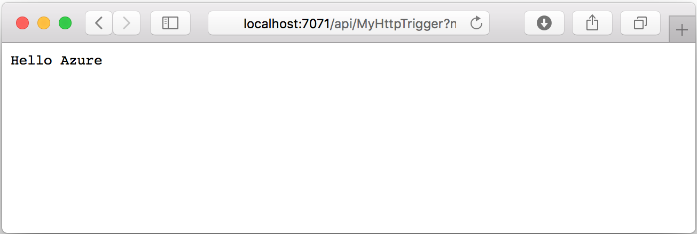

## Run the function locally

The following command starts the function app. The app runs using the same Azure Functions runtime that is in Azure.

```bash
func host start --build
```

The `--build` option is required to compile C# projects. You don't need this option for a JavaScript project.

When the Functions host starts, it write something like the following output, which has been truncated for readability:

```output

                  %%%%%%
                 %%%%%%
            @   %%%%%%    @
          @@   %%%%%%      @@
       @@@    %%%%%%%%%%%    @@@
     @@      %%%%%%%%%%        @@
       @@         %%%%       @@
         @@      %%%       @@
           @@    %%      @@
                %%
                %

...

Content root path: C:\functions\MyFunctionProj
Now listening on: http://0.0.0.0:7071
Application started. Press Ctrl+C to shut down.

...

Http Functions:

        HttpTrigger: http://localhost:7071/api/MyHttpTrigger

[8/27/2018 10:38:27 PM] Host started (29486ms)
[8/27/2018 10:38:27 PM] Job host started
```

Copy the URL of your `HttpTrigger` function from the runtime output and paste it into your browser's address bar. Append the query string `?name=<yourname>` to this URL and execute the request. The following shows the response in the browser to the GET request returned by the local function:



Now that you have run your function locally, you can create the function app and other required resources in Azure.