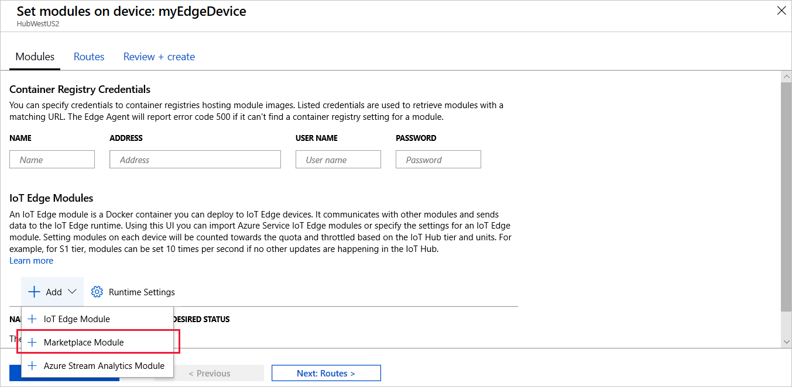
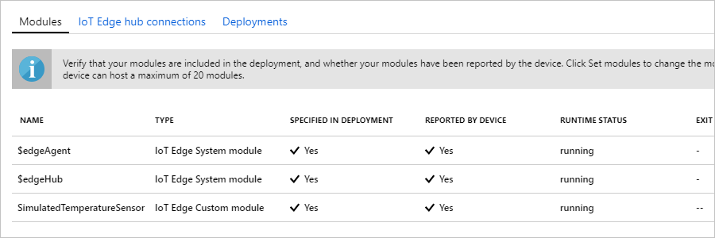

One of the key capabilities of Azure IoT Edge is being able to deploy code to your IoT Edge devices from the cloud. **IoT Edge modules** are executable packages implemented as containers. In this section, you deploy a pre-built module from the [IoT Edge Modules section of the Azure Marketplace](https://azuremarketplace.microsoft.com/marketplace/apps/category/internet-of-things?page=1&subcategories=iot-edge-modules). 

The module that you deploy in this section simulates a sensor and sends generated data. This module is a useful piece of code when you're getting started with IoT Edge because you can use the simulated data for development and testing. If you want to see exactly what this module does, you can view the [simulated temperature sensor source code](https://github.com/Azure/iotedge/blob/027a509549a248647ed41ca7fe1dc508771c8123/edge-modules/SimulatedTemperatureSensor/src/Program.cs). 

To deploy your first module from the Azure Marketplace, use the following steps:

1. In the [Azure portal](https://portal.azure.com), enter **Simulated Temperature Sensor** into the search and open the Marketplace result.

   

2. Choose an IoT Edge device to receive this module. On the **Target Devices for IoT Edge Module** page, provide the following information:

   1. **Subscription**: select the subscription that contains the IoT hub you're using.

   2. **IoT Hub**: select the name of the IoT hub you're using.

   3. **IoT Edge Device Name**: if you used the suggested device name earlier in this quickstart, enter **myEdgeDevice**. Or, select **Find Device** to choose from a list of IoT Edge devices in your IoT hub. 
   
   4. Select **Create**.

3. Now that you've chosen an IoT Edge module from the Azure Marketplace, and chosen an IoT Edge device to receive the module, you're taken to a three-step wizard that helps you define exactly how to deploy the module. In the **Add Modules** step of the wizard, notice that the **SimulatedTemperatureSensor** module is autopopulated. In the tutorials, you use this page to add additional modules to your deployment. For this quickstart, only deploy this one module. Select **Next** to continue to the next step of the wizard.

4. In the **Specify Routes** step of the wizard, you define how messages are passed between modules and to IoT Hub. For the quickstart, you want all messages from all modules to go to IoT Hub (`$upstream`). If it's not autopopulated, add the following code:

   ```json
    {
    "routes": {
        "route": "FROM /messages/* INTO $upstream"
        }
    }
   ```
   Then select **Next**.

5. In the **Review Deployment** step of the wizard, you can preview the JSON file that defines all the modules that get deployed to your IoT Edge device. Notice that the **SimulatedTemperatureSensor** module is included, and two additional system modules called **edgeAgent** and **edgeHub**. Select **Submit** when you're done reviewing.

   When you submit a new deployment to an IoT Edge device, nothing is pushed to your device. Instead, the device queries IoT Hub regularly for any new instructions. If the device finds an updated deployment manifest, it uses the information about the new deployment to pull the module images from the cloud then starts running the modules locally. This process may take a few minutes. 

6. After you submit the module deployment details, the wizard returns you to the **IoT Edge** page of your IoT hub. Select your device from the list of IoT Edge devices to see its details. 

7. On the device details page, scroll down to the **Modules** section. Three modules should be listed: $edgeAgent, $edgeHub, and SimulatedTemperatureSensor. If one or more of the modules are listed as specified in deployment but not reported by device, your IoT Edge device is still starting them. Wait a few moments and select **Refresh** at the top of the page. 

   
