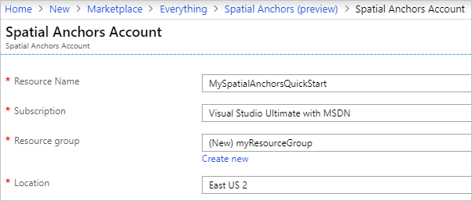
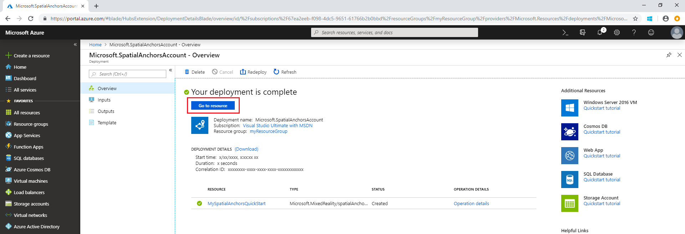

## Create a Spatial Anchors resource

### [Portal](#tab/azure-portal)

Go to the <a href="https://portal.azure.com" target="_blank">Azure portal</a>.

On the left pane, select **Create a resource**.

Use the search box to search for **Spatial Anchors**.


Select **Spatial Anchors**, and then select **Create**.

On the **Spatial Anchors Account** pane, do the following:

* Enter a unique resource name by using regular alphanumeric characters.
* Select the subscription that you want to attach the resource to.
* Create a resource group by selecting **Create new**. Name it **myResourceGroup**, and then select **OK**.

  [!INCLUDE [resource group intro text](resource-group.md)]

* Select a location (region) in which to place the resource.
* Select **New** to begin creating the resource.



After the resource is created, the Azure portal shows that your deployment is complete.



Select **Go to resource**. You can now view the resource properties.

Copy the resource's **Account ID** value into a text editor for later use.


Also copy the resource's **Account Domain** value into a text editor for later use.


Under **Settings**, select **Key**. Copy the **Primary key** value, **Account Key**, into a text editor for later use.


### [Azure CLI](#tab/azure-cli)

Start by preparing your environment for the Azure CLI:

[!INCLUDE [azure-cli-prepare-your-environment-no-header.md](azure-cli-prepare-your-environment-no-header.md)]

1. After you sign in, use the [az account set](/cli/azure/account#az_account_set) command to select the subscription in which to set up the spatial anchors account:

   ```azurecli
   az account set --subscription 00000000-0000-0000-0000-000000000000
   ```

1. Run the [az group create](/cli/azure/group#az_group_create) command to create a resource group, or use an existing resource group:

   ```azurecli
   az group create --name myResourceGroup --location eastus2
   ```

   [!INCLUDE [resource group intro text](resource-group.md)]

   You can view your current spatial anchors accounts for a resource group by using the [az spatial-anchors-account list](/cli/azure/ext/mixed-reality/spatial-anchors-account#ext_mixed_reality_az_spatial_anchors_account_list) command:

   ```azurecli
   az spatial-anchors-account list --resource-group myResourceGroup
   ```

   You can also view the spatial anchors accounts for your subscription:

   ```azurecli
   az spatial-anchors-account list
   ```

1. Run the [az spatial-anchors-account create](/cli/azure/ext/mixed-reality/spatial-anchors-account#ext_mixed_reality_az_spatial_anchors_account_create) command to create your spatial anchors account:

   ```azurecli
   az spatial-anchors-account create --resource-group myResourceGroup --name MySpatialAnchorsQuickStart --location eastus2
   ```

1. View the resource properties by using the [az spatial-anchors-account show](/cli/azure/ext/mixed-reality/spatial-anchors-account#ext_mixed_reality_az_spatial_anchors_account_show) command:

   ```azurecli
   az spatial-anchors-account show --resource-group myResourceGroup --name MySpatialAnchorsQuickStart
   ```

   Copy the resource **Account ID** value and the resource **Account Domain** value into a text editor for later use.

1. Run the [az spatial-anchors-account key show](/cli/azure/ext/mixed-reality/spatial-anchors-account/key#ext_mixed_reality_az_spatial_anchors_account_key_show) command to get your primary and secondary keys:

   ```azurecli
   az spatial-anchors-account key show --resource-group myResourceGroup --name MySpatialAnchorsQuickStart
   ```

   Copy the key values into a text editor for later use.

   If you need to regenerate keys, use the [az spatial-anchors-account key renew](/cli/azure/ext/mixed-reality/spatial-anchors-account/key#ext_mixed_reality_az_spatial_anchors_account_key_renew) command:

   ```azurecli
   az spatial-anchors-account key renew --resource-group myResourceGroup --name example --key primary
   az spatial-anchors-account key renew --resource-group myResourceGroup --name example --key secondary
   ```

You can delete an account by using the [az spatial-anchors-account delete](/cli/azure/ext/mixed-reality/spatial-anchors-account#ext_mixed_reality_az_spatial_anchors_account_delete) command:

```azurecli
az spatial-anchors-account delete --resource-group myResourceGroup --name MySpatialAnchorsQuickStart
```

### [Azure PowerShell](#tab/azure-powershell)

Start by preparing your environment for Azure PowerShell:

[!INCLUDE [azure-powershell-requirements-no-header.md](azure-powershell-requirements-no-header.md)]

> [!IMPORTANT]
> While the **Az.MixedReality** PowerShell module is in preview, you must install it separately using
> the `Install-Module` cmdlet. After this PowerShell module becomes generally available, it will be
> part of future Az PowerShell module releases and available by default from within Azure Cloud
> Shell.

```azurepowershell-interactive
Install-Module -Name Az.MixedReality
```

1. After you sign in, use the [Set-AzContext](/powershell/module/az.accounts/set-azcontext) cmdlet to select the subscription in which to set up the spatial anchors account:

   ```azurepowershell-interactive
   Set-AzContext -SubscriptionId 00000000-0000-0000-0000-000000000000
   ```

1. Run the [New-AzResourceGroup](/powershell/module/az.resources/new-azresourcegroup) cmdlet to create a resource group, or use an existing resource group:

   ```azurepowershell-interactive
   New-AzResourceGroup -Name myResourceGroup -Location eastus2
   ```

   [!INCLUDE [resource group intro text](resource-group.md)]

   You can view your current spatial anchors accounts for a resource group by using the [Get-AzSpatialAnchorsAccount](/powershell/module/az.mixedreality/get-azspatialanchorsaccount) cmdlet:

   ```azurepowershell-interactive
   Get-AzSpatialAnchorsAccount -ResourceGroup myResourceGroup
   ```

   You can also view the spatial anchors accounts for your subscription:

   ```azurepowershell-interactive
   Get-AzSpatialAnchorsAccount
   ```

1. Run the [New-AzSpatialAnchorsAccount](/powershell/module/az.mixedreality/new-azspatialanchorsaccount) cmdlet to create your spatial anchors account:

   ```azurepowershell-interactive
   New-AzSpatialAnchorsAccount -ResourceGroup myResourceGroup -Name MySpatialAnchorsQuickStart -Location eastus2
   ```

1. View the resource properties by using the [Get-AzSpatialAnchorsAccount](/powershell/module/az.mixedreality/get-azspatialanchorsaccount) cmdlet:

   ```azurepowershell-interactive
   Get-AzSpatialAnchorsAccount -ResourceGroup myResourceGroup -Name MySpatialAnchorsQuickStart
   ```

   Copy the property **accountId** value and the property **accountDomain** value into a text editor for later use.

1. Run the [Get-AzSpatialAnchorsAccountKey](/powershell/module/az.mixedreality/get-azspatialanchorsaccountkey) cmdlet to get your primary and secondary keys:

   ```azurepowershell-interactive
   Get-AzSpatialAnchorsAccountKey -ResourceGroup myResourceGroup -Name MySpatialAnchorsQuickStart
   ```

   Copy the key values into a text editor for later use.

   If you need to regenerate keys, use the [New-AzSpatialAnchorsAccountKey](/powershell/module/az.mixedreality/new-azspatialanchorsaccountkey) cmdlet:

   ```azurepowershell-interactive
   New-AzSpatialAnchorsAccountKey -ResourceGroupName myResourceGroup -Name MySpatialAnchorsQuickStart -Primary
   New-AzSpatialAnchorsAccountKey -ResourceGroupName myResourceGroup -Name MySpatialAnchorsQuickStart -Secondary
   ```

You can delete an account by using the [Remove-AzSpatialAnchorsAccount](/powershell/module/az.mixedreality/remove-azspatialanchorsaccount) cmdlet:

```azurepowershell-interactive
Remove-AzSpatialAnchorsAccount -ResourceGroup myResourceGroup -Name MySpatialAnchorsQuickStart
```

---
