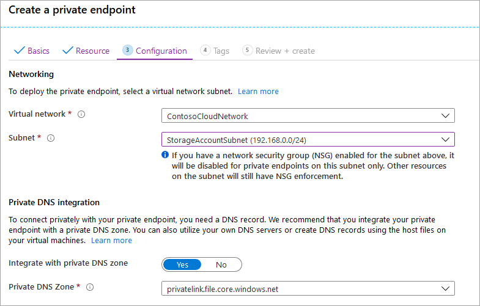

Navigate to the storage account for which you would like to create a private endpoint. In the table of contents for the storage account, select **Private endpoint connections**, and then **+ Private endpoint** to create a new private endpoint. 

The resulting wizard has multiple pages to complete.

In the **Basics** blade, select the desired resource group, name, and region for your private endpoint. These can be whatever you want, they don't have to match the storage account in any way, although you must create the private endpoint in the same region as the virtual network you wish to create the private endpoint in.

In the **Resource** blade, select the radio button for **Connect to an Azure resource in my directory**. Under **Resource type**, select **Microsoft.Storage/storageAccounts** for the resource type. The **Resource** field is the storage account with the Azure file share you wish to connect to. Target sub-resource is **file**, since this is for Azure Files.

The **Configuration** blade allows you to select the specific virtual network and subnet you would like to add your private endpoint to. You must select a distinct subnet from the subnet you added your service endpoint to above. The Configuration blade also contains the information for creating/update the private DNS zone. We recommend using the default `privatelink.file.core.windows.net` zone.

Click **Review + create** to create the private endpoint. 