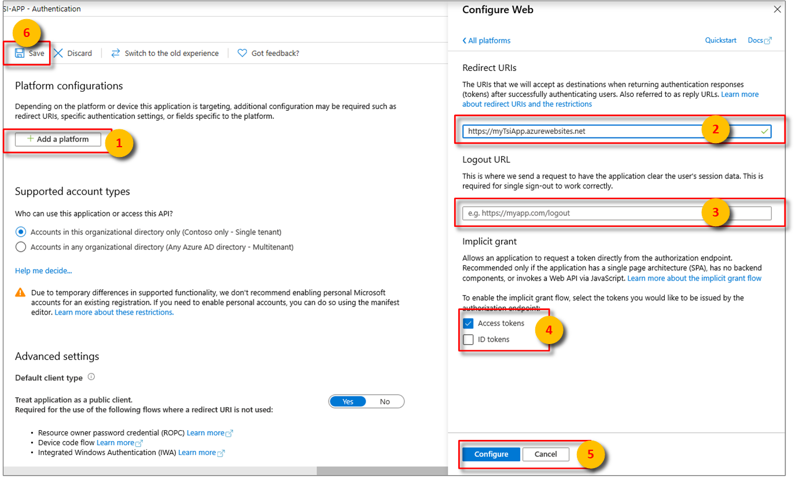
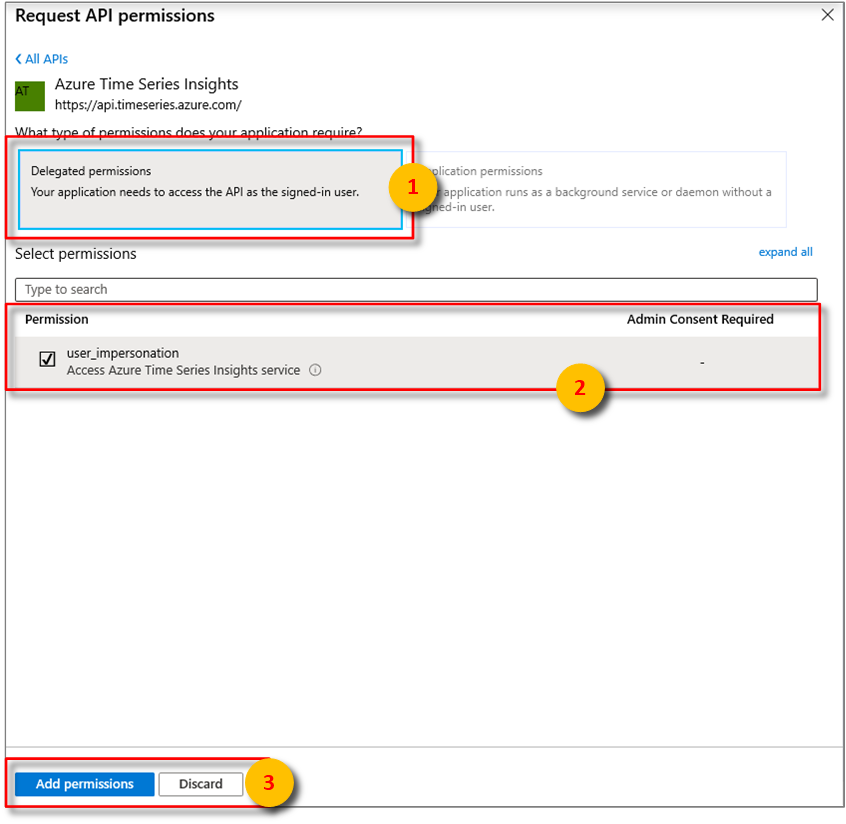

* After selecting the appropriate platform in step 4 of [Configure platform](https://docs.microsoft.com/azure/active-directory/develop/quickstart-register-app#configure-platform-settings) settings, configure your **Redirect URIs** and **Access Tokens** in the side panel to the right of the user interface.

    * **Redirect URIs** must match the address supplied by the authentication request:

        * For apps hosted in a local development environment, select **Public client (mobile & desktop)**. Make sure to set **public client** to **Yes**.
        * For Single-Page Apps hosted on Azure App Service, select **Web**.

    * Determine whether a **Logout URL** is appropriate.

    * Enable the implicit grant flow by checking **Access tokens** or **ID tokens**.

    

    Click **Configure**, then **Save**.

* Associate your Azure Active Directory app Azure Time Series Insights. Select **API permissions** > **Add a permission** > **APIs my organization uses**.

    

   Type `Azure Time Series Insights` into the search bar then select `Azure Time Series Insights`.

* Next, specify the kind API permission your app requires. By default, **Delegated permissions** will be highlighted. Choose a permission type then, select **Add permissions**.

    

* [Add Credentials](https://docs.microsoft.com/azure/active-directory/develop/quickstart-register-app#add-credentials) if the application will be calling your environment's APIs as itself. Credentials allow your application to authenticate as itself, requiring no interaction from a user at runtime.