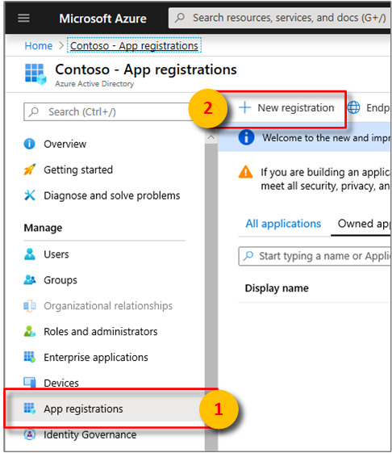
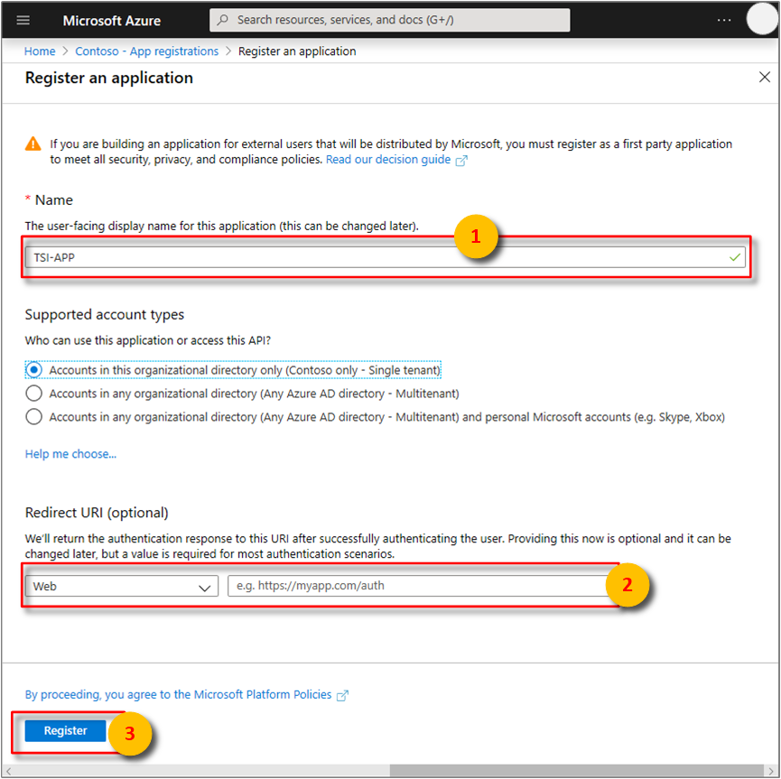
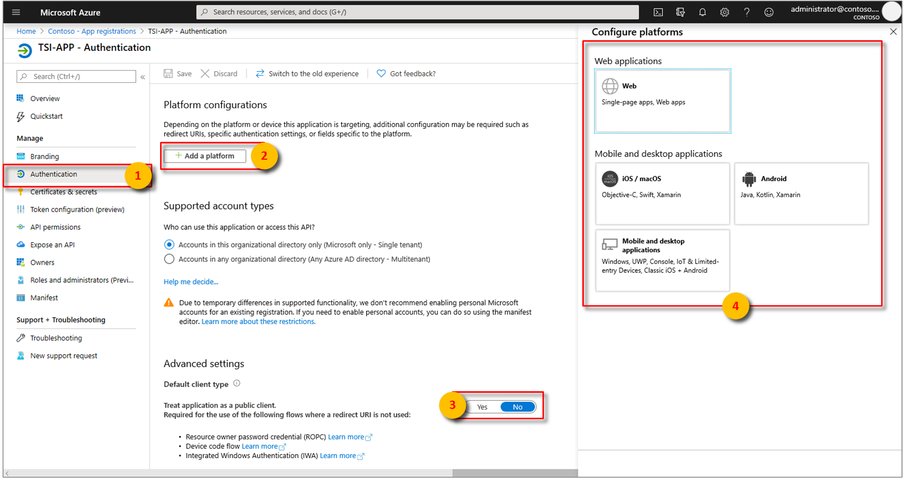
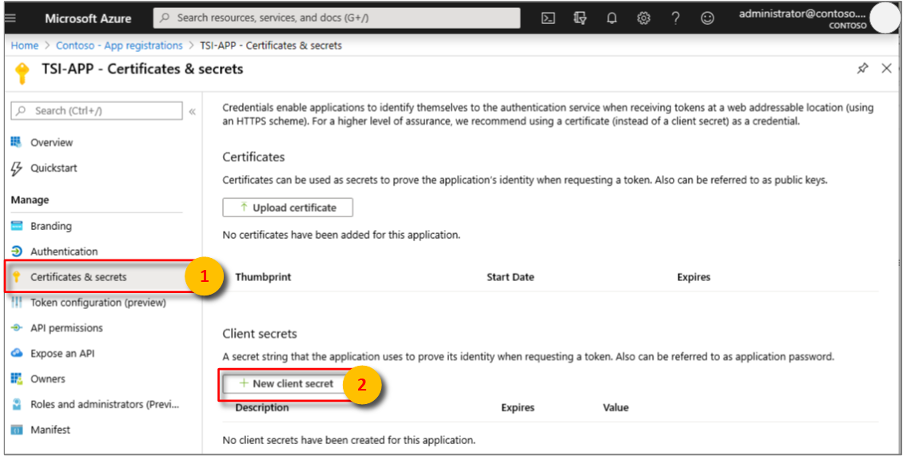
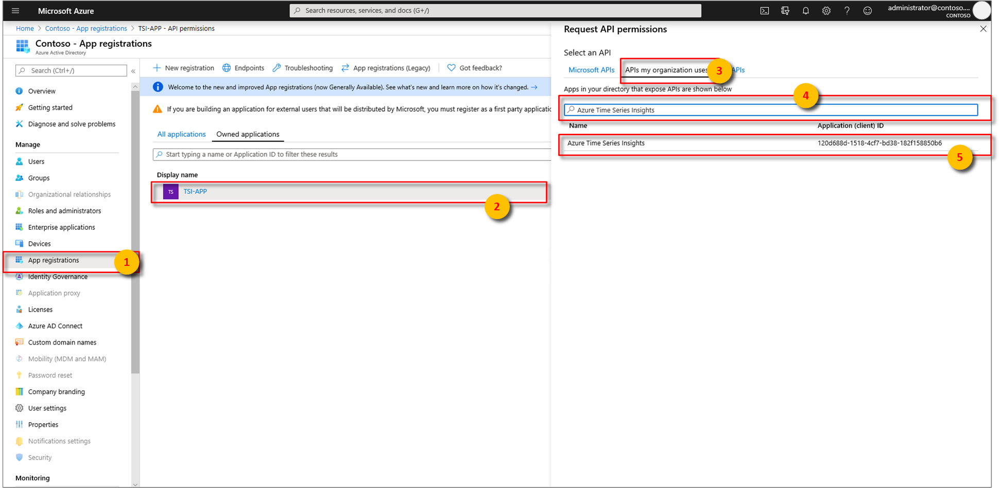

1. In the [Azure portal](https://ms.portal.azure.com/), select **Azure Active Directory** > **App registrations** > **New registration**.

   

    Your app will be listed here after you register it.

1. Give the application a name and select **Accounts in this organizational directory only** to specify the **Supported account types** that may access the API. Choose a valid URI  to redirect users to after they authenticate, then **Register**.

   

1. Important Azure Active Directory app information is displayed in your listed app's **Overview** blade. Select your app under **Owned applications**, then **Overview**.

   

   Copy your **Application (client) ID** to use in your client application.

1. The **Authentication** blade specifies important authentication configuration settings. 

    1. **Redirect URIs** must match the address supplied by the authentication request:

        * For apps hosted in a local development environment, select **Public client (mobile & desktop)**. Make sure to set the **Default client type** to yes.
        * For Single-Page apps hosted on Azure App Service, select **Web**.

    1. Enable the implicit grant flow by checking **Access tokens** or **ID tokens**.

   

   Click **Save**.

1. Select **Certificates & secrets** then **New client secret** to create an application password that client can use to prove its identity.

   

   Your client secret password will then be displayed. Copy the key to your favorite text editor.

   > [!NOTE]
   > You have the ability to import a certificate instead. For enhanced security, a certificate is recommended. To use a certificate, select **Upload certificate**.

1. Associate your Azure Active Directory app Azure TIme Series Insights. Select **API permissions** > **Add a permission** > **APIs my organization uses**. 

    

   Type `Azure Time Series Insights` into the search bar then select `Azure Time Series Insights`.

1. Next, specify the kind API permission your app requires. By default, **Delegated permissions** will be highlighted. Choose a permission type then, select **Add permissions**.

    