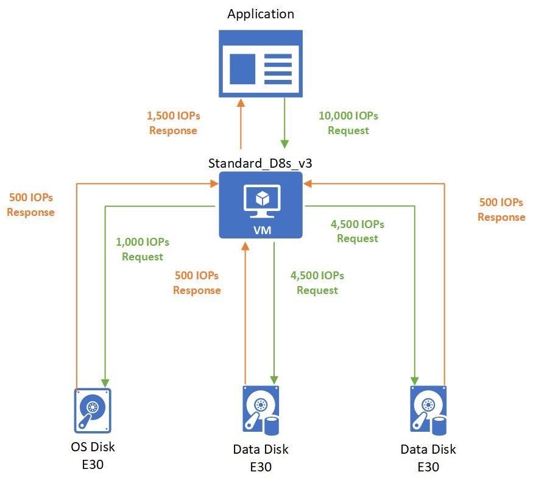

This article helps clarify disk performance and how it works with when you combine Azure Virtual Machines and Azure Disks. It also describes how you can diagnose bottlenecks for your disk IO and the changes you can make to optimize for performance.

## How does disk performance work?
Azure virtual machines have IOPS and throughput performance limits based on the virtual machine type and size. OS Disks and Data disks, which can be attached to virtual machines, have their own IOPs and throughput limits. When your application running on your virtual machines requests more IOPS or throughput than what is allotted for the virtual machine or the attached disks, your application's performance gets capped. When this happens, the application will experience suboptimal performance and can lead to some negative consequences like increased latency. Let’s run through a couple of examples to solidify this. To make these examples easy to follow, we'll only look at IOPs but the same logic applies to throughput as well.

## Disk IO capping
Set up:
- Standard_D8s_v3 
    - Uncached IOPS: 12,800
- E30 OS Disk
    - IOPS: 500 
- 2 E30 Data Disks
    - IOPS: 500

The application running on the virtual machine makes a request that requires 10,000 IOPs to the virtual machine. All of which are allowed by the VM because the Standard_D8s_v3 virtual machine can execute up to 12,800 IOPs. Those 10,000 IOPs requests are then broken down into three different requests to the different disks. 1,000 IOPs are requested to the operating system disk and 4,500 IOPs are requested to each data disk. Since all disks attached are E30 disks and can only handle 500 IOPs, they respond back with 500 IOPs each. The application's performance is then capped by the attached disks and can only process 1,500 IOPs. It could be working at peak performance at 10,000 IOPS if better performing disks were used, like Premium SSD P30 disks.

## Virtual machine IO capping
Set up:
- Standard_D8s_v3 
    - Uncached IOPS: 12,800
- P30 OS Disk
    - IOPS: 5,000 
- 2 P30 Data Disks 
    - IOPS: 5,000

The application running on the virtual machine makes a request that requires 15,000 IOPs. Unfortunately, the Standard_D8s_v3 virtual machine is only provisioned to handle 12,800 IOPs. From this, The application is capped by the virtual machine limits and must then allocate the allotted 12,800 IOPs. Those 12,800 IOPs requested are then broken down into three different requests to the different disks. 4,267 IOPs are requested to the operating system disk and 4,266 IOPs are requested to each data disk. Since all disks attached are P30 disks, which can handle 5,000 IOPs, they respond back with their requested amounts.