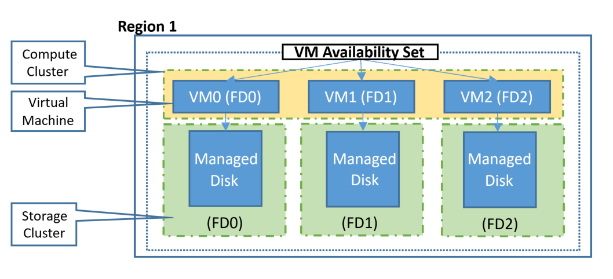

# Availability options for virtual machines in Azure
This article provides you with an overview of the availability features of Azure virtual machines (VMs).

## Availability sets
An availability set is a logical grouping of VMs within a datacenter that allows Azure to understand how your application is built to provide for redundancy and availability. We recommended that two or more VMs are created within an availability set to provide for a highly available application and to meet the [99.95% Azure SLA](https://azure.microsoft.com/support/legal/sla/virtual-machines/). There is no cost for the Availability Set itself, you only pay for each VM instance that you create. When a single VM is using [Azure premium SSDs](../articles/virtual-machines/windows/disks-types.md#premium-ssd), the Azure SLA applies for unplanned maintenance events.

An availability set is composed of two additional groupings that protect against hardware failures and allow updates to safely be applied - fault domains (FDs) and update domains (UDs). You can read more about how to manage the availability of [Linux VMs](../articles/virtual-machines/linux/manage-availability.md) or [Windows VMs](../articles/virtual-machines/windows/manage-availability.md).

### Fault domains
A fault domain is a logical group of underlying hardware that share a common power source and network switch, similar to a rack within an on-premises datacenter. As you create VMs within an availability set, the Azure platform automatically distributes your VMs across these fault domains. This approach limits the impact of potential physical hardware failures, network outages, or power interruptions.

### Update domains
An update domain is a logical group of underlying hardware that can undergo maintenance or be rebooted at the same time. As you create VMs within an availability set, the Azure platform automatically distributes your VMs across these update domains. This approach ensures that at least one instance of your application always remains running as the Azure platform undergoes periodic maintenance. The order of update domains being rebooted may not proceed sequentially during planned maintenance, but only one update domain is rebooted at a time.

### Managed Disk fault domains
For VMs using [Azure Managed Disks](../articles/virtual-machines/windows/faq-for-disks.md), VMs are aligned with managed disk fault domains when using a managed availability set. This alignment ensures that all the managed disks attached to a VM are within the same managed disk fault domain. Only VMs with managed disks can be created in a managed availability set. The number of managed disk fault domains varies by region - either two or three managed disk fault domains per region. You can read more about these managed disk fault domains for [Linux VMs](../articles/virtual-machines/linux/manage-availability.md?#use-managed-disks-for-vms-in-an-availability-set) or [Windows VMs](../articles/virtual-machines/windows/manage-availability.md?#use-managed-disks-for-vms-in-an-availability-set).

## Availability zones

[Availability zones](../articles/availability-zones/az-overview.md), an alternative to availability sets, expand the level of control you have to maintain the availability of the applications and data on your VMs. An Availability Zone is a physically separate zone within an Azure region. There are three Availability Zones per supported Azure region. Each Availability Zone has a distinct power source, network, and cooling. By architecting your solutions to use replicated VMs in zones, you can protect your apps and data from the loss of a datacenter. If one zone is compromised, then replicated apps and data are instantly available in another zone. 

Learn more about deploying a [Windows](../articles/virtual-machines/windows/create-powershell-availability-zone.md) or [Linux](../articles/virtual-machines/linux/create-cli-availability-zone.md) VM in an Availability Zone.

## Next steps
You can now start to use these availability and redundancy features to build your Azure environment. For best practices information, see [Azure availability best practices](../articles/best-practices-availability-checklist.md).

