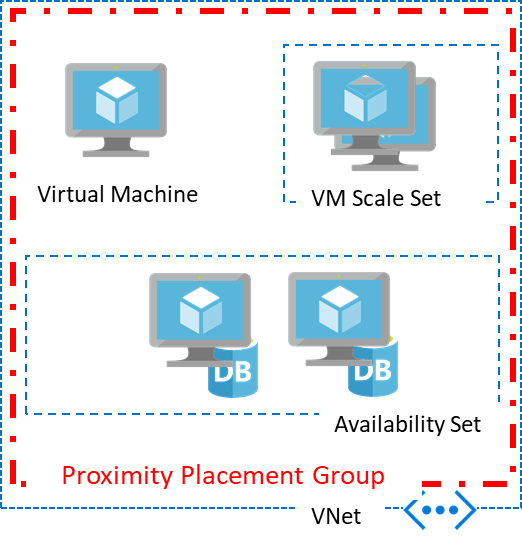

Placing VMs in a single region reduces the physical distance between the instances. Placing them within a single availability zone will also bring them physically closer together. However, as the Azure footprint grows, a single availability zone may span multiple physical data centers, which may result in a network latency impacting your application. 

To get VMs as close as possible, achieving the lowest possible latency, you should deploy them within a proximity placement group.

A proximity placement group is a logical grouping used to make sure that Azure compute resources are physically located close to each other. Proximity placement groups are useful for workloads where low latency is a requirement.

- Low latency between stand-alone VMs.
- Low Latency between VMs in a single availability set or a virtual machine scale set. 
- Low latency between stand-alone VMs, VMs in multiple Availability Sets, or multiple scale sets. You can have multiple compute resources in a single placement group to bring together a multi-tiered application. 
- Low latency between multiple application tiers using different hardware types. For example, running the backend using M-series in an availability set and the front end on a D-series instance, in a scale set, in a single proximity placement group.

## Using Proximity Placement Groups 

A proximity placement group is a new resource type in Azure. You need to create one before using it with other resources. Once created, it could be used with virtual machines, availability sets, or virtual machine scale sets. 
You specify a proximity placement group when creating compute resources providing the proximity placement group ID. 

You can also move an existing resource into a proximity placement group. When moving a resource into a proximity placement group, you should stop (deallocate) the asset first since it will be redeployed potentially into a different data center in the region to satisfy the colocation constraint. 

In the case of availability sets and virtual machine scale sets, you should set the proximity placement group at the resource level rather than the individual virtual machines. 

A proximity placement group is a colocation constraint rather than a pinning mechanism. It is pinned to a specific data center with the deployment of the first resource to use it. Once all resources using the proximity placement group have been stopped (deallocated) or deleted, it is no longer pinned. Therefore, when using a proximity placement group with multiple VM series, it is important to specify all the required types upfront in a template when possible or follow a deployment sequence which will improve your chances for a successful deployment. If your deployment fails, restart the deployment with the VM size which has failed as the first size to be deployed.

## What to expect when using Proximity Placement Groups 
Proximity placement groups offer co-location in the same data center. However, because proximity placement groups represent an additional deployment constraint, allocation failures can occur. There are few use cases where you may see allocation failures when using proximity placement groups:

- When you ask for the first virtual machine in the proximity placement group, the data center is automatically selected. In some cases, a second request for a different virtual machine SKU, may fail if it doesn't exist in that data center. In this case, an **OverconstrainedAllocationRequest** error is returned. To avoid this, try changing the order in which you deploy your SKUs or have both resources deployed using a single ARM template.
- 	In the case of elastic workloads, where you add and remove VM instances, having a proximity placement group constraint on your deployment may result in a failure to satisfy the request resulting in **AllocationFailure** error. 
- Stopping (deallocate) and starting your VMs as needed is another way to achieve elasticity. Since the capacity is not kept once you stop (deallocate) a VM, starting it again may result in an **AllocationFailure** error.

## Best practices 
- For the lowest latency, use proximity placement groups together with accelerated networking. For more information, see [Create a Linux virtual machine with Accelerated Networking](https://docs.microsoft.com/azure/virtual-network/create-vm-accelerated-networking-cli?toc=%2fazure%2fvirtual-machines%2flinux%2ftoc.json) or [Create a Windows virtual machine with Accelerated Networking](/azure/virtual-network/create-vm-accelerated-networking-powershell?toc=%2fazure%2fvirtual-machines%2fwindows%2ftoc.json).
- Deploy all VM sizes in a single template. In order to avoid landing on hardware that doesn't support all the VM SKUs and sizes you require, include all of the application tiers in a single template so that they will all be deployed at the same time.
- If you are scripting your deployment using PowerShell, CLI or the SDK, you may get an allocation error `OverconstrainedAllocationRequest`. In this case, you should stop/deallocate all the existing VMs, and change the sequence in the deployment script to begin with the VM SKU/sizes that failed. 
- When reusing an existing placement group from which VMs were deleted, wait for the deletion to fully complete before adding VMs to it.
- If latency is your first priority, put VMs in a proximity placement group and the entire solution in an availability zone. But, if resiliency is your top priority, spread your instances across multiple availability zones (a single proximity placement group cannot span zones).
