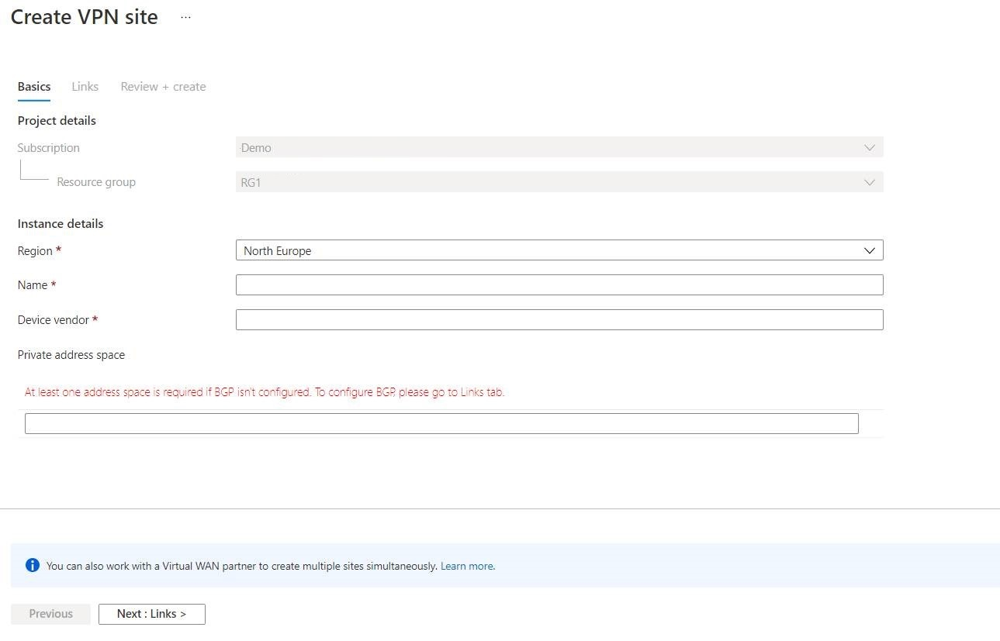
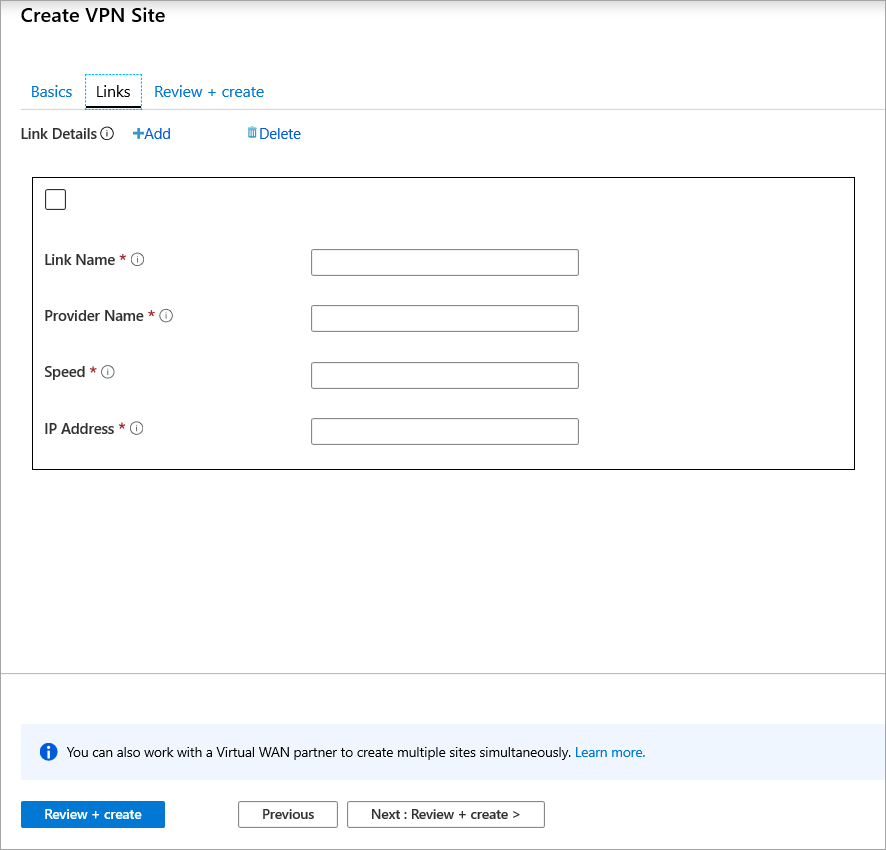

1. On the portal page for your virtual wan, in the **Connectivity** section, select **VPN sites** to open the VPN sites page.
2. On the **VPN sites** page, click **+Create site**.

   
3. On the **Create VPN Site** page,  on the **Basics** tab, complete the following fields:

    * **Region** - Previously referred to as location. This is the location you want to create this site resource in.
    * **Name** - The name by which you want to refer to your on-premises site.
    * **Device vendor** - The name of the VPN device vendor (for example: Citrix, Cisco, Barracuda). Doing so can help the Azure Team better understand your environment to add additional optimization possibilities in the future, or to help you troubleshoot.
    * **Border Gateway Protocol** - Enable implies all connections from the site will be BGP enabled. You will eventually set up the BGP information for each link from the VPN Site in the Links section. Configuring BGP on a Virtual WAN is equivalent to configuring BGP on an Azure virtual network gateway VPN. Your on-premises BGP peer address must not be the same as the public IP address of your VPN to device or the VNet address space of the VPN site. Use a different IP address on the VPN device for your BGP peer IP. It can be an address assigned to the loopback interface on the device.Specify this address in the corresponding VPN site representing the location. For BGP prerequisites, see [About BGP with Azure VPN Gateway](../articles/vpn-gateway/vpn-gateway-bgp-overview.md). You can always edit a VPN connection to update its BGP parameters (Peering IP on the link and the AS #) once the VPN Site BGP setting is enabled.
    * **Private address space** - The IP address space that is located on your on-premises site. Traffic destined for this address space is routed to your local site. This is required when BGP is not enabled for the site.
    * **Hubs** - The hub that you want your Site to connect to. A site can only be connected to the hubs that have a VPN Gateway. If you do not see a hub, create a VPN gateway in that hub first.
4. Select **Links** to add information about the physical links at the branch. If you have a virtual wan partner CPE device, check with them to see if this information is exchanged with Azure as a part of the branch information upload set up from their systems.

   

    * **Link Name** - A name you want to provide for the physical link at the VPN Site. Example: mylink1.
    * **Provider Name** - The name of the physical link at the VPN Site. Example: ATT, Verizon.
    * **Speed** - This is the speed of the VPN device at the branch location. Example: 50, which means 50 Mbps is the speed of the VPN device at the branch site.
    * **IP Address/FQDN** - Public IP address of the on-premises device using this link. Optionally, you can provide the private IP address of your on-premises VPN device that is behind ExpressRoute. You can also include a fully qualified domain name. For example, *something.contoso.com*. The FQDN should be resolvable from the VPN gateway. This is possible if the DNS server hosting this FQDN is reachable over internet. IP address takes precedence when both IP address and FQDN are specified.

      >[!NOTE]
      >* Supports one IPv4 address per FQDN. If the FQDN were to be resolved to multiple IP addresses, then the VPN gateway picks up the first IP4 address from the list. IPv6 addresses are not supported at this time.
      >* VPN gateway maintains a DNS cache which is refreshed every 5 minutes. The gateway tries to resolve FQDNs for disconnected tunnels only. A gateway reset or configuration change can also trigger FQDN resolution.
      >
5. You can use the checkbox to delete or add additional links. Four links per VPN Site are supported. For example, if you have four ISP (Internet service provider) at the branch location, you can create four links. one per each ISP, and provide the information for each link.
6. Once you have finished filling out the fields, select **Review + create** to verify and create the site.
7. View the status on the VPN sites page. The site will go to **Connection Needed** because the site has not yet been connected to the hub.
