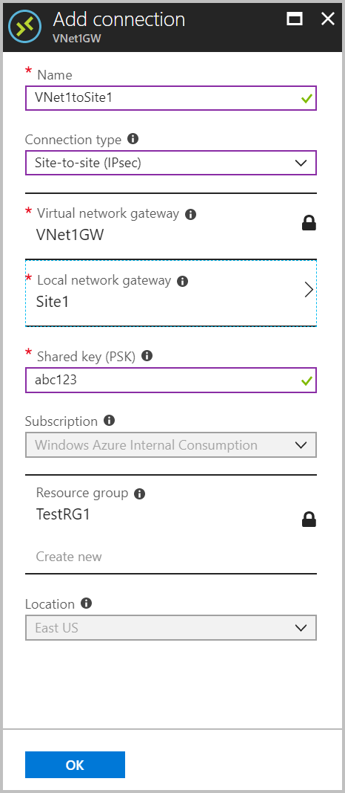

1. Navigate to and open the page for your virtual network gateway. There are multiple ways to navigate. You can navigate to the gateway 'VNet1GW' by going to **TestVNet1 -> Overview -> Connected devices -> VNet1GW**.
2. On the page for VNet1GW, click **Connections**. At the top of the Connections page, click **+Add** to open the **Add connection** page.

   
3. On the **Add connection** page, configure the values for your connection.

   - **Name:** Name your connection.
   - **Connection type:** Select **Site-to-site(IPSec)**.
   - **Virtual network gateway:** The value is fixed because you are connecting from this gateway.
   - **Local network gateway:** Click **Choose a local network gateway** and select the local network gateway that you want to use.
   - **Shared Key:** the value here must match the value that you are using for your local on-premises VPN device. The example uses 'abc123', but you can (and should) use something more complex. The important thing is that the value you specify here must be the same value that you specify when configuring your VPN device.
   - The remaining values for **Subscription**, **Resource Group**, and **Location** are fixed.

4. Click **OK** to create your connection. You'll see *Creating Connection* flash on the screen.
5. You can view the connection in the **Connections** page of the virtual network gateway. The Status will go from *Unknown* to *Connecting*, and then to *Succeeded*.
