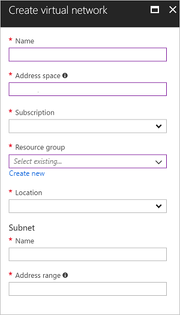

You can create a VNet with the Resource Manager deployment model and the Azure portal by following these steps. For more information about virtual networks, see [Virtual Network overview](../articles/virtual-network/virtual-networks-overview.md).

>[!NOTE]
>For the VNet to connect to an on-premises location, coordinate with your on-premises network administrator to carve out an IP address range that you can use specifically for this virtual network. If a duplicate address range exists on both sides of the VPN connection, traffic will route in an unexpected way. Additionally, if you want to connect this VNet to another VNet, the address space cannot overlap with other VNet. Plan your network configuration accordingly.
>
>

1. Sign in to the [Azure portal](https://portal.azure.com) and select **Create a resource**. The **New** page opens.

2. In the **Search the marketplace** field, enter *virtual network* and select **Virtual network** from the returned list. The **Virtual network** page opens.

   

3. From the **Select a deployment model** list near the bottom of the page, select **Resource Manager**, and then select **Create**. The **Create virtual network** page opens.

   

4. On the **Create virtual network** page, configure the VNet settings. When you fill in the fields, the red exclamation mark becomes a green check mark when the characters you enter in the field are validated. Some values are autofilled, which you can replace with your own values:

   - **Name**: Enter the name for your virtual network.

   - **Address space**: Enter the address space. If you have multiple address spaces to add, enter your first address space here. You can add additional address spaces later, after you create the VNet.

   - **Subscription**: Verify that the subscription listed is the correct one. You can change subscriptions by using the drop-down.

   - **Resource group**: Select an existing resource group, or create a new one by entering a name for your new resource group. If you're creating a new group, name the resource group according to your planned configuration values. For more information about resource groups, see [Azure Resource Manager overview](../articles/azure-resource-manager/resource-group-overview.md#resource-groups).

   - **Location**: Select the location for your VNet. The location determines where the resources that you deploy to this VNet will live.

   - **Subnet**: Add the subnet **Name** and subnet **Address range**. You can add additional subnets later, after you create the VNet. 
     
5. Select **Create**.
