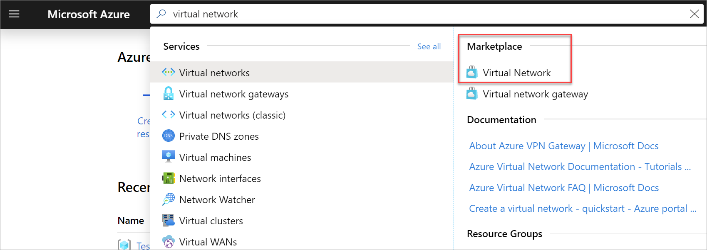
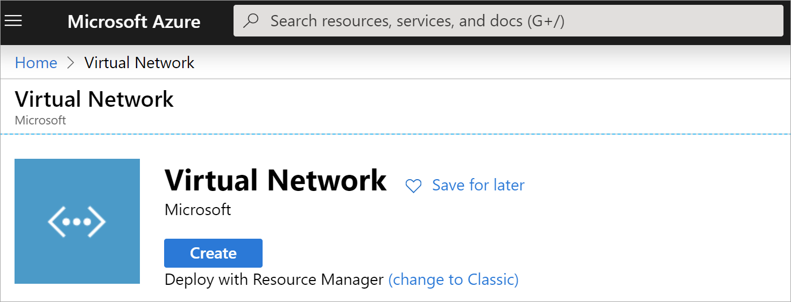
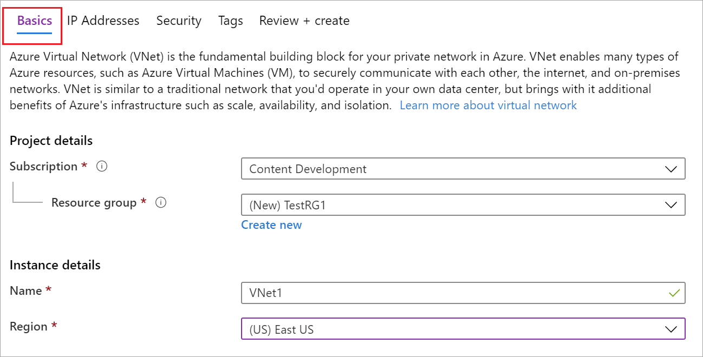

1. Sign in to the [Azure portal](https://portal.azure.com).
1. In **Search resources, service, and docs (G+/)**, type *virtual network*.

   
1. Select **Virtual Network** from the **Marketplace** results.

   
1. On the **Virtual Network** page, select **Create**.

   
1. Once you select **Create**, the **Create virtual network** page opens.
1. On the **Basics** tab, configure **Project details** and **Instance details** VNet settings.

    When you fill in the fields, you see a green check mark when the characters you enter in the field are validated. Some values are autofilled, which you can replace with your own values:

   - **Subscription**: Verify that the subscription listed is the correct one. You can change subscriptions by using the drop-down.
   - **Resource group**: Select an existing resource group, or click **Create new** to create a new one. For more information about resource groups, see [Azure Resource Manager overview](../articles/azure-resource-manager/management/overview.md#resource-groups).
   - **Name**: Enter the name for your virtual network.
   - **Region**: Select the location for your VNet. The location determines where the resources that you deploy to this VNet will live.

1. On the **IP Addresses** tab, configure the values. The values shown in the examples below are for demonstration purposes. Adjust these values according to the settings that you require.

     
   - **IPv4 address space**: By default, an address space is automatically created. You can click the address space to adjust it to reflect your own values. You can also add additional address spaces.
   - **Subnet**: If you use the default address space, a default subnet is created automatically. If you change the address space, you need to add a subnet. Select **+ Add subnet** to open the **Add subnet** window. Configure the following settings and then select **Add** to add the values:
      - **Subnet name**: In this example, we named the subnet "FrontEnd".
      - **Subnet address range**: The address range for this subnet.

1. On the **Security** tab, at this time, leave the default values:

   - **DDos protection**: Basic
   - **Firewall**: Disabled
1. Select **Review + create** to validate the virtual network settings.
1. After the settings have been validated, select **Create**.
